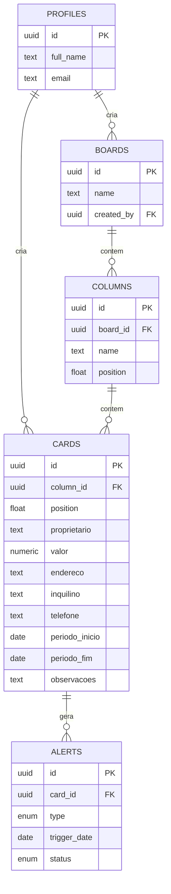

# Modelo de dados — Kanban de Aluguel

## Diagrama de entidades



## Entidades

- **profiles** — espelha `auth.users` do Supabase; criado automaticamente no cadastro (trigger `handle_new_user`).
- **boards** — o quadro kanban. Existe como tabela própria (em vez de fixo no código) para não travar o sistema caso um dia surja a necessidade de separar por carteira/região — mas hoje só existe um board (`seed.sql` já cria o padrão).
- **columns** — colunas do board, nome livre e `position` para reordenar.
- **cards** — cada card é uma casa/imóvel. Campos obrigatórios: `proprietario`, `valor`, `endereco`. Opcionais: `inquilino`, `telefone` (usado para o botão de acionar/WhatsApp na etapa 7), `periodo_inicio`/`periodo_fim` (período do aluguel), `observacoes`.
- **alerts** — alertas gerados pelo job de verificação de vencimento (etapa 7 do roadmap). Guarda histórico e evita duplicar aviso no mesmo dia.

## Decisões de design

- **`position` como `double precision` (fractional indexing)** — ao arrastar um card ou coluna, só é preciso calcular a média entre os vizinhos (ex: mover entre posições 1000 e 2000 → nova posição 1500), sem reescrever a ordem de todos os outros registros. Padrão comum em kanbans (Trello, Linear).
- **RLS "equipe com acesso total"** — como definido, todos os usuários autenticados têm o mesmo nível de acesso; as políticas checam apenas `auth.role() = 'authenticated'`, sem segmentar por dono do registro. Fica fácil evoluir para papéis (roles) depois, se um dia for necessário.
- **Índice único em `alerts (card_id, type, trigger_date)`** — garante que o job de alerta seja idempotente: rodar a verificação diária várias vezes não duplica notificação.
- **`valor` como `numeric(12,2)`** — evita erros de arredondamento de ponto flutuante em valores monetários.
- **Cascata (`on delete cascade`)** — apagar uma coluna remove seus cards; apagar um card remove seus alertas. Evita registros órfãos.

## Como aplicar

Com o [Supabase CLI](https://supabase.com/docs/guides/cli) instalado e o projeto linkado:

```bash
supabase db push
```

Para popular com os dados iniciais (board + 3 colunas do rascunho):

```bash
supabase db execute -f supabase/seed.sql
```
