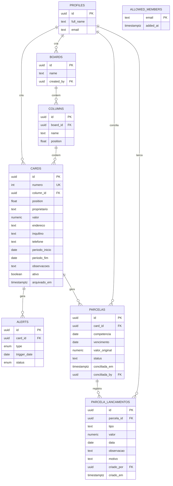

# Modelo de dados — Kanban de Aluguel

## Diagrama de entidades



`allowed_members` aparece solta de propósito: ela não se liga a nenhuma outra
tabela por chave estrangeira. O vínculo é feito em tempo de consulta, comparando
o e-mail do JWT — ver [RLS por allowlist](#decisões-de-design).

## Entidades

- **profiles** — espelha `auth.users` do Supabase; criado automaticamente no cadastro (trigger `handle_new_user`).
- **boards** — o quadro kanban. Existe como tabela própria (em vez de fixo no código) para não travar o sistema caso um dia surja a necessidade de separar por carteira/região — mas hoje só existe um board (`seed.sql` já cria o padrão).
- **columns** — colunas do board, nome livre e `position` para reordenar.
- **cards** — cada card é uma casa/imóvel. Campos obrigatórios: `proprietario`, `valor`, `endereco`. Opcionais: `inquilino`, `telefone` (usado para o botão de acionar/WhatsApp na etapa 7), `periodo_inicio`/`periodo_fim` (período do aluguel), `observacoes`. `numero` é o identificador sequencial legível (`#1`, `#2`, `#3`…), exibido no card do Board e usado como filtro exato na consulta do Financeiro — ver [identificador sequencial por sequence](#decisões-de-design) para o porquê de não ser um `uuid` nem um número recalculado na leitura. `arquivado_em` é nulo enquanto o contrato está em operação normal; preenchido, guarda a data/hora do arquivamento mais recente — ver [`timestamptz` em vez de `boolean` para arquivamento](#decisões-de-design).
- **alerts** — guarda apenas a **resolução** de um alerta ("já avisei o inquilino", "não interessa"). Os alertas em si não são gravados: o app os recalcula a partir de `periodo_fim` a cada leitura (`web/src/lib/kanban/alerts.ts`), então nunca ficam desatualizados e não é preciso um job agendado com chave privilegiada. Uma linha aqui só existe quando alguém clicou em resolver.
- **parcelas** — uma linha por contrato por mês de competência. `competencia` é sempre o dia 1 do mês de referência (`2026-08-01`), guardado como `date` e não como texto `"08/2026"`, para não haver ambiguidade de formato; a constraint `parcelas_competencia_dia_1` garante isso. `valor_original` é uma fotografia do `valor` do card no momento em que a parcela nasceu, então reajustar o aluguel não reescreve parcela que já existe. O `status` guardado é só `aberta`, `parcial`, `paga` ou `conciliada` — "a vencer" e "vencida" **não** são status guardados: saem da comparação entre `vencimento` e a data de hoje, feita na leitura (ver [geração de parcelas preguiçosa](#decisões-de-design)).
- **parcela_lancamentos** — o livro-razão da parcela. Cada pagamento, acréscimo, desconto e destrava é uma linha nova; nada é editado nem apagado — exceto o cancelamento de um pagamento por engano, a segunda exceção deliberada ao append-only (ver [Cancelamento de pagamento](#decisões-de-design), Phase 11). O valor devido e o valor pago da parcela são somas dos lançamentos, não colunas (ver [livro-razão append-only](#decisões-de-design)). `motivo` é obrigatório quando `tipo` é `destrava`, por constraint no banco (`parcela_lancamentos_destrava_exige_motivo`) — é isso que faz o histórico de destravas ter valor.
- **allowed_members** — a lista de quem pode usar o sistema, por e-mail. É ela que as policies de RLS consultam; não tem policy de select, ou seja, só é legível pelo SQL Editor / `service_role`.

## Decisões de design

- **`position` como `double precision` (fractional indexing)** — ao arrastar um card ou coluna, só é preciso calcular a média entre os vizinhos (ex: mover entre posições 1000 e 2000 → nova posição 1500), sem reescrever a ordem de todos os outros registros. Padrão comum em kanbans (Trello, Linear).
- **RLS por allowlist, "equipe com acesso total" entre quem está nela** — todo mundo em `allowed_members` tem o mesmo nível de acesso a `boards`/`columns`/`cards`/`alerts`/`parcelas`/`parcela_lancamentos`, sem segmentar por dono do registro; `profiles` é a exceção, cada um só lê o próprio. As policies checam `public.is_team_member()` (uma função `security definer` que confere o e-mail do JWT contra `allowed_members`), não mais `auth.role() = 'authenticated'` como no schema inicial — ver migration `20260811000000_security_hardening.sql`. Isso importa na prática: **estar autenticado não basta**. Convidar alguém pelo painel do Supabase cria o login mas não dá acesso a nada; é preciso também inserir o e-mail em `allowed_members` (só possível via SQL Editor/`service_role`, já que a tabela não tem policy de select). Quem loga sem estar na allowlist não vê erro nenhum — só um board vazio, porque o RLS filtra as linhas silenciosamente. Runbook operacional em `supabase/hardening_seguranca.sql`. Fica fácil evoluir para papéis (roles) depois, se um dia for necessário. As duas tabelas financeiras entraram no mesmo perímetro de `is_team_member()` sem nenhum esquema de permissão novo — dado financeiro não é um caso especial de segurança neste projeto, é só mais dado protegido pela mesma allowlist.
- **Validação de dados também no banco** — `CHECK` constraints em `cards` e `columns` (valor positivo, tamanhos de texto, formato de telefone, período coerente) replicam a validação do formulário React, porque escrever direto via PostgREST contorna qualquer regra que exista só no cliente. Ver `20260811000000_security_hardening.sql`. `parcelas` e `parcela_lancamentos` seguem a mesma régua, com as regras nomeadas em `20260816000000_financeiro_schema.sql`: um lançamento de tipo `destrava` sem `motivo`, por exemplo, é recusado pelo banco mesmo que o formulário deixe passar.
- **Índice único em `alerts (card_id, type, trigger_date)`** — o `upsert` que grava a resolução de um alerta (`web/src/lib/kanban/queries.ts`) usa essa chave, então resolver o mesmo alerta mais de uma vez atualiza a linha existente em vez de duplicar.
- **`valor` como `numeric(12,2)`** — evita erros de arredondamento de ponto flutuante em valores monetários.
- **Cascata (`on delete cascade`)** — apagar uma coluna remove seus cards; apagar um card remove seus alertas. Evita registros órfãos.
- **Livro-razão append-only em `parcela_lancamentos`** — baixa parcial, multa por atraso, desconto e correção de uma parcela já conciliada são a mesma operação: inserir uma linha em `parcela_lancamentos`. Como nada é sobrescrito nem apagado, "correção com histórico" sai de graça, sem tabela de auditoria paralela. É por isso que `parcelas` não tem coluna `valor_pago` nem `valor_devido`: os dois são somas dos lançamentos (`valor_original` mais acréscimos menos descontos; e a soma dos lançamentos de `pagamento`) — uma coluna gravada poderia divergir do livro-razão sem ninguém perceber. O custo aceito é deliberado: todo lugar que mostra valor de parcela precisa somar lançamentos, mais trabalho de leitura em troca de nunca ter dois números discordando.
- **Geração de parcelas preguiçosa, na leitura, sem job agendado** — três motivos concretos. Primeiro, um cron precisaria escrever com chave privilegiada (`service_role`), e o projeto nunca usa isso: toda escrita passa pela sessão do usuário para o RLS continuar valendo como rede de proteção. Segundo, um job que falha às 3 da manhã falha em silêncio, enquanto uma geração que roda ao abrir a aba falha na frente de alguém. Terceiro, é o mesmo padrão que os alertas de contrato já usam em `web/src/lib/kanban/alerts.ts`, que recalcula na leitura em vez de guardar. Reabrir a aba não duplica nada porque o índice único `parcelas_unica_por_competencia` torna a operação idempotente por construção, no banco, não por cuidado do código. A mesma lógica cobre a contrapartida: "a vencer" e "vencida" não são valores guardados, são a comparação de `vencimento` com hoje feita na leitura — ninguém precisa rodar nada para "virar o mês".
- **Identificador sequencial por `sequence` com backfill único, não `uuid` nem recálculo na leitura** — `cards.id` é um `uuid`, ótimo como chave técnica (imprevisível, gerável no cliente, sem coordenação), péssimo como identificador legível: ninguém digita, memoriza ou fala em voz alta um `uuid` para localizar um contrato ("o contrato #12" versus "o contrato `3f9a2b1c-...`"). `cards.numero` resolve isso com uma `sequence` dedicada (`cards_numero_seq`) mais um backfill único, feito uma vez em `20260818000000_cards_numero_sequencial.sql`, que numera os contratos existentes por ordem de criação (`row_number() over (order by created_at, id)`) e depois passa a numeração para `nextval()` no `default` da coluna — o mesmo padrão que `id uuid default gen_random_uuid()` já usa, por isso `createCardAction` (`web/src/lib/kanban/actions.ts`) não precisou de nenhuma mudança de código. A alternativa óbvia — recalcular o número a cada leitura, por exemplo pela posição numa ordenação por `created_at` — foi descartada porque um número *recalculado* muda sempre que outro contrato é excluído (o contrato que era `#12` vira `#11` se o `#5` for apagado), quebrando silenciosamente qualquer referência salva a esse número (um filtro, um link, uma conversa com inquilino/proprietário citando "o contrato #12"). Um número *atribuído uma vez* e nunca recalculado é estável para sempre, ao custo de eventualmente ter buracos na sequência se um contrato for excluído — trade-off aceito porque estabilidade de referência importa mais do que numeração contígua aqui.
- **`ativo` como flag manual em `cards`, não derivada de `periodo_fim`** — um contrato pode parar de gerar parcela por razões que a data não conhece: inquilino saiu antes do fim, imóvel em reforma, contrato em renegociação; e contrato por prazo indeterminado não tem `periodo_fim` nenhum para derivar. Derivar da data também faria o sistema parar de gerar parcela sozinho num dia em que ninguém pensou — exatamente o tipo de surpresa que o módulo existe para evitar. Além disso `periodo_fim` já move os alertas de contrato; pendurar um segundo comportamento nela acoplaria duas coisas que mudam por motivos diferentes. O default `true` existe para que os imóveis já cadastrados continuassem funcionando sem ninguém tocar em nada. Consequência operacional: desativar um contrato só impede parcela **nova** — as que já existem continuam listadas e gerenciáveis até serem resolvidas.
- **`timestamptz` em vez de `boolean` para arquivamento** — `cards.arquivado_em` (migration `20260819000000_cards_arquivado_em.sql`) guarda **quando** o contrato foi arquivado, não só **se** foi. Rastreabilidade é barata de desenhar agora e cara de acrescentar depois — um `boolean` exigiria uma segunda coluna de data no dia em que alguém pedisse "desde quando este contrato está arquivado". A coluna nasceu nulável, sem default e sem backfill: nulo já significa "não arquivado", então não existe nenhum estado anterior a preencher para os contratos existentes.
- **O trigger `cards_impede_exclusao_com_lancamento` como backstop de banco contra exclusão com histórico financeiro** — `cards → parcelas → parcela_lancamentos` é `on delete cascade` desde `20260816000000_financeiro_schema.sql`, e `columns → cards` é `on delete cascade` desde o schema inicial (`20260728000000_init_schema.sql`) — ou seja, existem **dois** caminhos que apagam histórico financeiro em cascata, e a Server Action de exclusão de card (`deleteCardAction`) só cobre um deles (o outro, excluir a coluna inteira, nunca foi coberto). O trigger `before delete on cards for each row` cobre os dois e sobrevive a um caminho de código futuro que esqueça a trava — exatamente como o buraco atual nasceu (`deleteCardAction` foi escrita antes de `parcelas` existir e nunca foi revisitada). A trava dispara para qualquer `parcela_lancamentos` ligado ao card, de qualquer tipo (pagamento, acréscimo, desconto, destrava e, no futuro, conciliação), então roda `security invoker` (não `definer`): com `definer`, o `select` interno ignoraria o RLS de `parcelas`/`parcela_lancamentos`, vazando "existe lançamento" para quem nem deveria ver o card. Deliberadamente **não** virou `on delete restrict` na FK: isso bloquearia também a exclusão de um contrato que só tem parcelas geradas automaticamente, sem nenhum lançamento — o que a regra de negócio quer permitir — e seria alterar uma FK existente em vez de só acrescentar algo novo.
- **Por que não há índice em `arquivado_em`** — `cards` tem hoje a ordem de dezenas de linhas; nesse volume o planner do Postgres varre a tabela inteira de qualquer jeito (mais barato que usar índice), então um índice aqui só acrescentaria custo de manutenção em todo insert/update de `cards` sem ganho de leitura. Gatilho explícito para revisitar: se `cards` passar da ordem de milhares de linhas, o primeiro passo é um índice parcial `on cards (id) where arquivado_em is not null` (ou o equivalente sobre `is null`, dependendo de qual lado da consulta dominar).
- **A visibilidade de parcela é derivada na leitura, não gravada em coluna (D-01)** — toda a regra mora em `avaliarVisibilidadeParcela`, `web/src/lib/kanban/visibilidade.ts`, e é a **única** implementação em todo o projeto: tanto a leitura (Financeiro, via `filtrarParcelasVisiveis`) quanto a escrita (`registrarPagamentoAction`/`ajustarParcelaAction`, via `exigirParcelaVisivel` em `actions.ts`) consomem exatamente esta função — duas implementações da "mesma" regra divergem na primeira vez que qualquer uma das duas for editada, e a divergência é silenciosa (a tela esconde, o servidor aceita). É o modo de falha que motivou a Phase 6.2: `cards.ativo` filtrava a geração de parcela mas não a escrita, e ninguém percebeu até um humano olhar produção. A ordem de avaliação, exata:
  1. Sem `card` (nulo ou ausente), a regra não pode ser avaliada — resposta segura é recusar, não presumir visível.
  2. `card.arquivado_em` não nulo → oculta. Contrato arquivado some de tudo (D-08), e este passo vem **antes** do passo seguinte porque arquivar é um ato explícito do operador que tira o contrato inteiro de operação — resolve a colisão entre "parcela com lançamento sempre aparece" e "arquivado some de tudo" a favor do arquivamento.
  3. Tem ao menos um lançamento (`parcela_lancamentos`) → sempre visível, ignora todo o resto. O override de D-01/D-05: o dinheiro entrou de verdade, então a parcela nunca some, mesmo fora do período e mesmo com o contrato inativo.
  4. Competência fora do período atual do card (`periodo_inicio`/`periodo_fim` como estão *agora*) → oculta.
  5. Contrato inativo **e** competência maior que o mês atual → oculta (D-02: inativo esconde só o futuro; mês atual e meses passados, inclusive vencidas em aberto, continuam visíveis e operáveis).
  6. Nenhum dos motivos acima → visível.
- **Por que nada é apagado quando uma parcela deixa de aparecer (D-03)** — ocultar é reversível de graça, apagar não: o usuário pode marcar um contrato como inativo ou encurtar um período por engano, e se o sistema apagasse teria que regenerar depois. A parcela também guarda `valor_original`, uma fotografia do valor do card no momento em que foi gerada (D-05/D-18 da Phase 6.1) — regenerar depois produziria um valor diferente e reescreveria história.
- **A poda ativa de parcelas órfãs reverte D-03 (D-01, Phase 9)** — o item acima continua valendo para todo o resto da regra de visibilidade (contrato inativo, contrato arquivado: essas continuam só escondidas, nunca apagadas), mas estreita numa exceção: uma parcela `aberta` sem nenhum lançamento em `parcela_lancamentos`, que fica fora do período atual do card (`periodo_inicio`/`periodo_fim` como estão *agora*, nas duas direções — cortar o início ou cortar o fim do contrato podam igual) passa a ser **apagada de verdade**, não só escondida, no instante em que o período do contrato é editado (`updateCardAction`, síncrono com a própria gravação). Critério exato: `status = 'aberta'` **e** zero linhas em `parcela_lancamentos` para aquela parcela **e** competência fora do novo período — as duas primeiras condições são redundantes na prática (todo status diferente de `aberta` implica pelo menos um lançamento) mas ambas são checadas, defesa em profundidade deliberada contra apagar histórico financeiro por engano. Por quê: o usuário viu 27 parcelas órfãs vazarem nos relatórios da Phase 8 (dois contratos de teste com período editado) e pediu explicitamente para não acumular "informação solta e desnecessária" no banco — ocultar não bastava mais. Consequência aceita, a mesma que o item de D-03 original já previa para o caso de regenerar: reabrir o período depois gera uma parcela nova do zero, com `valor_original` fotografando o `valor` do card **naquele momento**, que pode já divergir do valor original. As 27 órfãs que já existiam antes desta fase foram removidas uma única vez por um script SQL revisável (`supabase/limpeza_parcelas_orfas.sql`), nunca por uma migração automática.
- **Cancelamento de pagamento (D-01, Phase 11) — a segunda exceção deliberada ao livro-razão append-only** — a Phase 9 (item acima) apagava linhas de `parcelas` (parcelas órfãs sem nenhum lançamento); esta é a primeira vez que uma linha do livro-razão em si, `parcela_lancamentos`, é apagada de verdade. Escopo estreito e deliberado: só lançamentos `tipo='pagamento'`, só quando a parcela não está `conciliada` (trava reusada de `exigirParcelaNaoConciliada`, D-06 daquela fase), um lançamento por vez — o botão "Cancelar" em `ParcelaHistoricoSheet` apaga só o lançamento clicado, nunca todos os pagamentos da parcela de uma vez. Diferente de Destravar (Phase 7), que desfaz uma conciliação lançando um evento novo em vez de apagar o registro antigo, cancelar um pagamento não deixa nenhum rastro de quem cancelou, quando, ou por quê — esse trade-off foi levantado diretamente ao usuário antes de perguntar, e ele confirmou apagar mesmo assim (`.planning/phases/11-cancelamento-de-pagamento/11-CONTEXT.md` D-01). A garantia que sobra: o status da parcela depois do cancelamento é sempre recalculado a partir do que resta no livro-razão (`recalcularEGravarStatus`), nunca fixado num valor específico — o resultado pode legitimamente pousar em `aberta` (zero pagamentos restantes) ou `parcial` (ainda sobra algum pagamento, menor que o devido).
- **O tradeoff de filtrar visibilidade em memória (D-06)** — a regra depende de "tem lançamento", do período atual do card e do mês corrente ao mesmo tempo, e não se expressa numa única query PostgREST. O caminho escolhido é consultar como já se consultava (o `select` do Financeiro já traz o embed `parcela_lancamentos`) e aplicar a função pura sobre o resultado. Com ~48 contratos e ~24 parcelas cada, o custo é irrelevante. **Gatilho de revisão:** se o volume subir uma ordem de grandeza, o caminho é uma view no banco ou uma coluna denormalizada mantida por trigger — não é para resolver agora, é para não ser redescoberto do zero depois.
- **Por que `arquivado_em` é filtro de query e não parte da regra em memória (D-08)** — é um predicado simples e barato que o banco resolve sozinho (`cards.arquivado_em is null`), ao contrário do resto da regra de visibilidade. A função pura `avaliarVisibilidadeParcela` ainda conhece o caso (retorna o motivo `arquivado`), porque o caminho de escrita precisa dele para recusar com a mensagem certa quando uma aba desatualizada tenta escrever num contrato recém-arquivado.

## Como aplicar

Com o [Supabase CLI](https://supabase.com/docs/guides/cli) instalado e o projeto linkado:

```bash
supabase db push
```

Para popular com os dados iniciais (board + 3 colunas do rascunho):

```bash
supabase db execute -f supabase/seed.sql
```

Para conferir que as regras do módulo financeiro realmente valem no banco (constraints, índices e a barreira de RLS por allowlist), rode `supabase/verificacao_financeiro.sql` no SQL Editor do Supabase, um bloco de cada vez. No mesmo espírito de `supabase/hardening_seguranca.sql`, toda transação do runbook termina em `rollback`, então rodá-lo não deixa nenhum dado de teste no banco.
