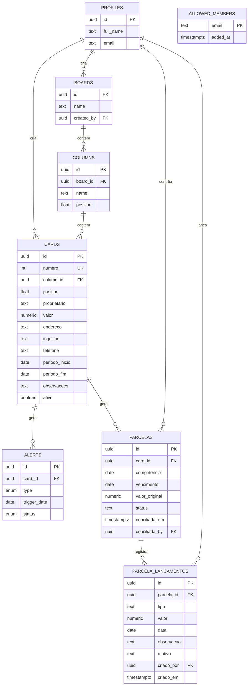

# Modelo de dados — Kanban de Aluguel

## Diagrama de entidades



`allowed_members` aparece solta de propósito: ela não se liga a nenhuma outra
tabela por chave estrangeira. O vínculo é feito em tempo de consulta, comparando
o e-mail do JWT — ver [RLS por allowlist](#decisões-de-design).

## Entidades

- **profiles** — espelha `auth.users` do Supabase; criado automaticamente no cadastro (trigger `handle_new_user`).
- **boards** — o quadro kanban. Existe como tabela própria (em vez de fixo no código) para não travar o sistema caso um dia surja a necessidade de separar por carteira/região — mas hoje só existe um board (`seed.sql` já cria o padrão).
- **columns** — colunas do board, nome livre e `position` para reordenar.
- **cards** — cada card é uma casa/imóvel. Campos obrigatórios: `proprietario`, `valor`, `endereco`. Opcionais: `inquilino`, `telefone` (usado para o botão de acionar/WhatsApp na etapa 7), `periodo_inicio`/`periodo_fim` (período do aluguel), `observacoes`. `numero` é o identificador sequencial legível (`#1`, `#2`, `#3`…), exibido no card do Board e usado como filtro exato na consulta do Financeiro — ver [identificador sequencial por sequence](#decisões-de-design) para o porquê de não ser um `uuid` nem um número recalculado na leitura.
- **alerts** — guarda apenas a **resolução** de um alerta ("já avisei o inquilino", "não interessa"). Os alertas em si não são gravados: o app os recalcula a partir de `periodo_fim` a cada leitura (`web/src/lib/kanban/alerts.ts`), então nunca ficam desatualizados e não é preciso um job agendado com chave privilegiada. Uma linha aqui só existe quando alguém clicou em resolver.
- **parcelas** — uma linha por contrato por mês de competência. `competencia` é sempre o dia 1 do mês de referência (`2026-08-01`), guardado como `date` e não como texto `"08/2026"`, para não haver ambiguidade de formato; a constraint `parcelas_competencia_dia_1` garante isso. `valor_original` é uma fotografia do `valor` do card no momento em que a parcela nasceu, então reajustar o aluguel não reescreve parcela que já existe. O `status` guardado é só `aberta`, `parcial`, `paga` ou `conciliada` — "a vencer" e "vencida" **não** são status guardados: saem da comparação entre `vencimento` e a data de hoje, feita na leitura (ver [geração de parcelas preguiçosa](#decisões-de-design)).
- **parcela_lancamentos** — o livro-razão da parcela. Cada pagamento, acréscimo, desconto e destrava é uma linha nova; nada é editado nem apagado. O valor devido e o valor pago da parcela são somas dos lançamentos, não colunas (ver [livro-razão append-only](#decisões-de-design)). `motivo` é obrigatório quando `tipo` é `destrava`, por constraint no banco (`parcela_lancamentos_destrava_exige_motivo`) — é isso que faz o histórico de destravas ter valor.
- **allowed_members** — a lista de quem pode usar o sistema, por e-mail. É ela que as policies de RLS consultam; não tem policy de select, ou seja, só é legível pelo SQL Editor / `service_role`.

## Decisões de design

- **`position` como `double precision` (fractional indexing)** — ao arrastar um card ou coluna, só é preciso calcular a média entre os vizinhos (ex: mover entre posições 1000 e 2000 → nova posição 1500), sem reescrever a ordem de todos os outros registros. Padrão comum em kanbans (Trello, Linear).
- **RLS por allowlist, "equipe com acesso total" entre quem está nela** — todo mundo em `allowed_members` tem o mesmo nível de acesso a `boards`/`columns`/`cards`/`alerts`/`parcelas`/`parcela_lancamentos`, sem segmentar por dono do registro; `profiles` é a exceção, cada um só lê o próprio. As policies checam `public.is_team_member()` (uma função `security definer` que confere o e-mail do JWT contra `allowed_members`), não mais `auth.role() = 'authenticated'` como no schema inicial — ver migration `20260811000000_security_hardening.sql`. Isso importa na prática: **estar autenticado não basta**. Convidar alguém pelo painel do Supabase cria o login mas não dá acesso a nada; é preciso também inserir o e-mail em `allowed_members` (só possível via SQL Editor/`service_role`, já que a tabela não tem policy de select). Quem loga sem estar na allowlist não vê erro nenhum — só um board vazio, porque o RLS filtra as linhas silenciosamente. Runbook operacional em `supabase/hardening_seguranca.sql`. Fica fácil evoluir para papéis (roles) depois, se um dia for necessário. As duas tabelas financeiras entraram no mesmo perímetro de `is_team_member()` sem nenhum esquema de permissão novo — dado financeiro não é um caso especial de segurança neste projeto, é só mais dado protegido pela mesma allowlist.
- **Validação de dados também no banco** — `CHECK` constraints em `cards` e `columns` (valor positivo, tamanhos de texto, formato de telefone, período coerente) replicam a validação do formulário React, porque escrever direto via PostgREST contorna qualquer regra que exista só no cliente. Ver `20260811000000_security_hardening.sql`. `parcelas` e `parcela_lancamentos` seguem a mesma régua, com as regras nomeadas em `20260816000000_financeiro_schema.sql`: um lançamento de tipo `destrava` sem `motivo`, por exemplo, é recusado pelo banco mesmo que o formulário deixe passar.
- **Índice único em `alerts (card_id, type, trigger_date)`** — o `upsert` que grava a resolução de um alerta (`web/src/lib/kanban/queries.ts`) usa essa chave, então resolver o mesmo alerta mais de uma vez atualiza a linha existente em vez de duplicar.
- **`valor` como `numeric(12,2)`** — evita erros de arredondamento de ponto flutuante em valores monetários.
- **Cascata (`on delete cascade`)** — apagar uma coluna remove seus cards; apagar um card remove seus alertas. Evita registros órfãos.
- **Livro-razão append-only em `parcela_lancamentos`** — baixa parcial, multa por atraso, desconto e correção de uma parcela já conciliada são a mesma operação: inserir uma linha em `parcela_lancamentos`. Como nada é sobrescrito nem apagado, "correção com histórico" sai de graça, sem tabela de auditoria paralela. É por isso que `parcelas` não tem coluna `valor_pago` nem `valor_devido`: os dois são somas dos lançamentos (`valor_original` mais acréscimos menos descontos; e a soma dos lançamentos de `pagamento`) — uma coluna gravada poderia divergir do livro-razão sem ninguém perceber. O custo aceito é deliberado: todo lugar que mostra valor de parcela precisa somar lançamentos, mais trabalho de leitura em troca de nunca ter dois números discordando.
- **Geração de parcelas preguiçosa, na leitura, sem job agendado** — três motivos concretos. Primeiro, um cron precisaria escrever com chave privilegiada (`service_role`), e o projeto nunca usa isso: toda escrita passa pela sessão do usuário para o RLS continuar valendo como rede de proteção. Segundo, um job que falha às 3 da manhã falha em silêncio, enquanto uma geração que roda ao abrir a aba falha na frente de alguém. Terceiro, é o mesmo padrão que os alertas de contrato já usam em `web/src/lib/kanban/alerts.ts`, que recalcula na leitura em vez de guardar. Reabrir a aba não duplica nada porque o índice único `parcelas_unica_por_competencia` torna a operação idempotente por construção, no banco, não por cuidado do código. A mesma lógica cobre a contrapartida: "a vencer" e "vencida" não são valores guardados, são a comparação de `vencimento` com hoje feita na leitura — ninguém precisa rodar nada para "virar o mês".
- **Identificador sequencial por `sequence` com backfill único, não `uuid` nem recálculo na leitura** — `cards.id` é um `uuid`, ótimo como chave técnica (imprevisível, gerável no cliente, sem coordenação), péssimo como identificador legível: ninguém digita, memoriza ou fala em voz alta um `uuid` para localizar um contrato ("o contrato #12" versus "o contrato `3f9a2b1c-...`"). `cards.numero` resolve isso com uma `sequence` dedicada (`cards_numero_seq`) mais um backfill único, feito uma vez em `20260818000000_cards_numero_sequencial.sql`, que numera os contratos existentes por ordem de criação (`row_number() over (order by created_at, id)`) e depois passa a numeração para `nextval()` no `default` da coluna — o mesmo padrão que `id uuid default gen_random_uuid()` já usa, por isso `createCardAction` (`web/src/lib/kanban/actions.ts`) não precisou de nenhuma mudança de código. A alternativa óbvia — recalcular o número a cada leitura, por exemplo pela posição numa ordenação por `created_at` — foi descartada porque um número *recalculado* muda sempre que outro contrato é excluído (o contrato que era `#12` vira `#11` se o `#5` for apagado), quebrando silenciosamente qualquer referência salva a esse número (um filtro, um link, uma conversa com inquilino/proprietário citando "o contrato #12"). Um número *atribuído uma vez* e nunca recalculado é estável para sempre, ao custo de eventualmente ter buracos na sequência se um contrato for excluído — trade-off aceito porque estabilidade de referência importa mais do que numeração contígua aqui.
- **`ativo` como flag manual em `cards`, não derivada de `periodo_fim`** — um contrato pode parar de gerar parcela por razões que a data não conhece: inquilino saiu antes do fim, imóvel em reforma, contrato em renegociação; e contrato por prazo indeterminado não tem `periodo_fim` nenhum para derivar. Derivar da data também faria o sistema parar de gerar parcela sozinho num dia em que ninguém pensou — exatamente o tipo de surpresa que o módulo existe para evitar. Além disso `periodo_fim` já move os alertas de contrato; pendurar um segundo comportamento nela acoplaria duas coisas que mudam por motivos diferentes. O default `true` existe para que os imóveis já cadastrados continuassem funcionando sem ninguém tocar em nada. Consequência operacional: desativar um contrato só impede parcela **nova** — as que já existem continuam listadas e gerenciáveis até serem resolvidas.

## Como aplicar

Com o [Supabase CLI](https://supabase.com/docs/guides/cli) instalado e o projeto linkado:

```bash
supabase db push
```

Para popular com os dados iniciais (board + 3 colunas do rascunho):

```bash
supabase db execute -f supabase/seed.sql
```

Para conferir que as regras do módulo financeiro realmente valem no banco (constraints, índices e a barreira de RLS por allowlist), rode `supabase/verificacao_financeiro.sql` no SQL Editor do Supabase, um bloco de cada vez. No mesmo espírito de `supabase/hardening_seguranca.sql`, toda transação do runbook termina em `rollback`, então rodá-lo não deixa nenhum dado de teste no banco.
