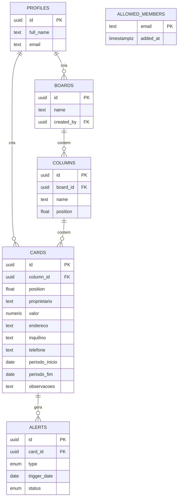

# Modelo de dados — Kanban de Aluguel

## Diagrama de entidades



`allowed_members` aparece solta de propósito: ela não se liga a nenhuma outra
tabela por chave estrangeira. O vínculo é feito em tempo de consulta, comparando
o e-mail do JWT — ver [RLS por allowlist](#decisões-de-design).

## Entidades

- **profiles** — espelha `auth.users` do Supabase; criado automaticamente no cadastro (trigger `handle_new_user`).
- **boards** — o quadro kanban. Existe como tabela própria (em vez de fixo no código) para não travar o sistema caso um dia surja a necessidade de separar por carteira/região — mas hoje só existe um board (`seed.sql` já cria o padrão).
- **columns** — colunas do board, nome livre e `position` para reordenar.
- **cards** — cada card é uma casa/imóvel. Campos obrigatórios: `proprietario`, `valor`, `endereco`. Opcionais: `inquilino`, `telefone` (usado para o botão de acionar/WhatsApp na etapa 7), `periodo_inicio`/`periodo_fim` (período do aluguel), `observacoes`.
- **alerts** — guarda apenas a **resolução** de um alerta ("já avisei o inquilino", "não interessa"). Os alertas em si não são gravados: o app os recalcula a partir de `periodo_fim` a cada leitura (`web/src/lib/kanban/alerts.ts`), então nunca ficam desatualizados e não é preciso um job agendado com chave privilegiada. Uma linha aqui só existe quando alguém clicou em resolver.
- **allowed_members** — a lista de quem pode usar o sistema, por e-mail. É ela que as policies de RLS consultam; não tem policy de select, ou seja, só é legível pelo SQL Editor / `service_role`.

## Decisões de design

- **`position` como `double precision` (fractional indexing)** — ao arrastar um card ou coluna, só é preciso calcular a média entre os vizinhos (ex: mover entre posições 1000 e 2000 → nova posição 1500), sem reescrever a ordem de todos os outros registros. Padrão comum em kanbans (Trello, Linear).
- **RLS por allowlist, "equipe com acesso total" entre quem está nela** — todo mundo em `allowed_members` tem o mesmo nível de acesso a `boards`/`columns`/`cards`/`alerts`, sem segmentar por dono do registro; `profiles` é a exceção, cada um só lê o próprio. As policies checam `public.is_team_member()` (uma função `security definer` que confere o e-mail do JWT contra `allowed_members`), não mais `auth.role() = 'authenticated'` como no schema inicial — ver migration `20260811000000_security_hardening.sql`. Isso importa na prática: **estar autenticado não basta**. Convidar alguém pelo painel do Supabase cria o login mas não dá acesso a nada; é preciso também inserir o e-mail em `allowed_members` (só possível via SQL Editor/`service_role`, já que a tabela não tem policy de select). Quem loga sem estar na allowlist não vê erro nenhum — só um board vazio, porque o RLS filtra as linhas silenciosamente. Runbook operacional em `supabase/hardening_seguranca.sql`. Fica fácil evoluir para papéis (roles) depois, se um dia for necessário.
- **Validação de dados também no banco** — `CHECK` constraints em `cards` e `columns` (valor positivo, tamanhos de texto, formato de telefone, período coerente) replicam a validação do formulário React, porque escrever direto via PostgREST contorna qualquer regra que exista só no cliente. Ver `20260811000000_security_hardening.sql`.
- **Índice único em `alerts (card_id, type, trigger_date)`** — o `upsert` que grava a resolução de um alerta (`web/src/lib/kanban/queries.ts`) usa essa chave, então resolver o mesmo alerta mais de uma vez atualiza a linha existente em vez de duplicar.
- **`valor` como `numeric(12,2)`** — evita erros de arredondamento de ponto flutuante em valores monetários.
- **Cascata (`on delete cascade`)** — apagar uma coluna remove seus cards; apagar um card remove seus alertas. Evita registros órfãos.

## Como aplicar

Com o [Supabase CLI](https://supabase.com/docs/guides/cli) instalado e o projeto linkado:

```bash
supabase db push
```

Para popular com os dados iniciais (board + 3 colunas do rascunho):

```bash
supabase db execute -f supabase/seed.sql
```
